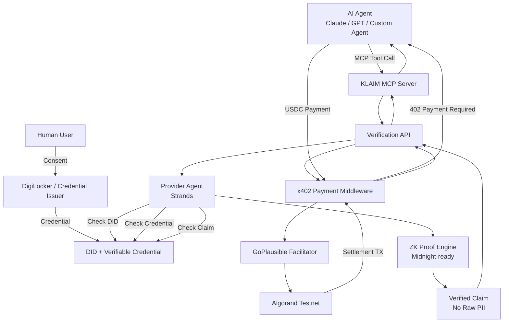
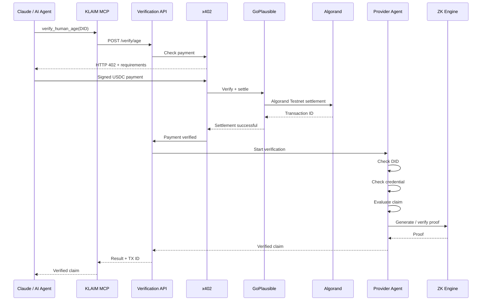

# KLAIM

### Pay-Per-Use Human Verification API for AI Agents

> **Verify users without exposing their documents.**

KLAIM is a privacy-first verification infrastructure that allows applications and AI agents to verify claims about a user — such as **Age > 18** — without receiving the user's underlying identity documents or raw PII.

[](https://algorand.com/)
[](https://www.x402.org/)
[](https://modelcontextprotocol.io/)
[](https://midnight.network/)

---

## 🚀 What is KLAIM?

Modern applications increasingly need to verify that a user is eligible for a service.

For example:

- Is this user over 18?
- Is this user a resident of a particular country?
- Does this user possess a valid credential?
- Has this user completed a required verification?
- Is this a verified human?

The traditional approach is to collect the actual identity document.

That creates a major privacy problem.

An application may only need to know:

```text
Age > 18 = TRUE
````

but instead receives:

```text
Name
Date of Birth
Address
Aadhaar/PAN information
Document number
Issuer information
Full document
```

### KLAIM changes this model.

Instead of applications receiving documents, KLAIM exposes a **pay-per-use human verification API**.

The application or AI agent asks:

```text
"Is this person over 18?"
```

KLAIM performs the verification internally and returns:

```json
{
  "verified": true,
  "claim": "AGE_OVER_18"
}
```

The underlying credential and personal information remain private.

> **KLAIM sells verification, not identity data.**
## 🔗 Verified Algorand Testnet Transactions

KLAIM uses the **x402 payment protocol** to enable pay-per-use human verification.

For the MVP, payments are settled in **USDC on Algorand Testnet**. The following transactions are real on-chain transfers from the **payer wallet → provider wallet**, each representing a **0.01 USDC verification payment**.

> These are not simulated transaction IDs. They are real Algorand Testnet transactions and can be independently verified using the AlgoKit Lora explorer.

### Live x402 Payment Evidence

| # | Amount | Network | Flow | Transaction |
|---|---:|---|---|---|
| 1 | 0.01 USDC | Algorand Testnet | Payer → Provider | [View on Lora](https://lora.algokit.io/testnet/transaction/NFK244G4UE5OEBFXQEK4CFSFPZLLHLBOANA3IA47ACHYB2YIUF5Q) |
| 2 | 0.01 USDC | Algorand Testnet | Payer → Provider | [View on Lora](https://lora.algokit.io/testnet/transaction/7LI27EZD7MZZYZKMTE4IMIQDPDD3BOPB5TPJURM7CIIYL2VROKZA) |
| 3 | 0.01 USDC | Algorand Testnet | Payer → Provider | [View on Lora](https://lora.algokit.io/testnet/transaction/C7DO3LR4ZCTVP2IMATXQFDCSYPW2NE2ZATNREQ65G7ZOJUPOEL5A) |
| 4 | 0.01 USDC | Algorand Testnet | Payer → Provider | [View on Lora](https://lora.algokit.io/testnet/transaction/4CSDN7BOSMTCCXMOKGNGNLITPSULC5H4OAZKK7OAHQROSX4ZIQ4A) |

### What This Demonstrates

The payment layer is designed around the following flow:

```text
AI Agent
   │
   │ MCP tool call
   ▼
KLAIM Verification API
   │
   │ No payment
   ▼
HTTP 402 Payment Required
   │
   │ x402 payment requirements
   ▼
AI Agent / Payer Wallet
   │
   │ Sign USDC payment
   ▼
GoPlausible Facilitator
   │
   │ Verify + settle
   ▼
Algorand Testnet
   │
   │ Real USDC transaction
   ▼
Provider Wallet
   │
   │ Settlement confirmed
   ▼
KLAIM Verification
   │
   ▼
Verified Claim
---

# 🎯 Problem

Digital onboarding and AI-agent workflows have three major problems.

### 1. Over-collection of personal information

Applications collect complete identity documents even when they only need one attribute.

### 2. AI agents cannot easily perform trusted identity verification

AI agents can interact with APIs and tools, but identity verification still requires manual document workflows.

### 3. Verification APIs are not naturally machine-payable

Traditional verification providers usually depend on subscriptions, accounts, billing systems, or manual payment workflows.

KLAIM combines:

* **MCP** for AI-agent interoperability
* **x402** for machine-to-machine payments
* **Algorand** for on-chain settlement
* **DID / VC** for identity
* **Zero-Knowledge Proofs** for privacy-preserving verification

into a single verification infrastructure layer.

---

# 💡 The Core Idea

KLAIM separates identity from verification.

### Traditional Verification

```text
User
 │
 │ Upload document
 ▼
Application
 │
 ├── Name
 ├── DOB
 ├── Address
 ├── ID Number
 └── Full Document
```

### KLAIM Archetecture


```text
User
 │
 │ Credential + Consent
 ▼
KLAIM
 │
 │ Verify privately
 │
 │ ZK Proof
 ▼
Application / AI Agent
 │
 └── "AGE > 18 = TRUE"
```

The application receives the **answer**, not the document.

---

# 🏗️ Architecture



---

# 🔄 Complete Verification Flow

## 1. Human onboarding

The user connects their identity credential source.

For the MVP, DigiLocker is the intended credential source.

```text
Human
  │
  ▼
DigiLocker
  │
  ▼
Credential
  │
  ▼
KLAIM DID
```

KLAIM stores credential references and derived claims rather than exposing complete identity documents to verification consumers.

---

## 2. AI Agent connects through MCP

AI agents connect to KLAIM through the **Model Context Protocol (MCP)**.

```text
Claude / GPT / Custom Agent
            │
            │ MCP
            ▼
     KLAIM MCP Server
```

The MCP server exposes verification tools such as:

```text
verify_human_age
```

An agent can therefore request:

```text
Verify whether DID xyz is over 18.
```

---

## 3. Agent authentication

Every verifier receives a unique KLAIM agent credential.

Example:

```text
Agent ID:
agent_xxxxxxxxx

Agent Key:
klm_xxxxxxxxxxxxxxxxx
```

The key is:

* generated by KLAIM
* displayed once
* hashed before storage
* revocable
* rotatable

---

# 4. Verification Request

The MCP tool calls the protected verification API.

```http
POST /api/v1/verify/age
```

Example:

```json
{
  "did": "did:klaim:demo-user-001"
}
```

---

# 5. x402 Payment Boundary

The verification API is protected by **x402**.

If no valid payment is attached:

```http
HTTP/1.1 402 Payment Required
```

The x402 layer provides the payment requirements required by the client.

The flow becomes:

```text
AI Agent
   │
   │ POST /verify/age
   ▼
KLAIM
   │
   │ HTTP 402
   ▼
AI Agent
   │
   │ Prepare payment
   ▼
x402
```

---

# 6. USDC Payment

The verifier agent pays for the verification using USDC on **Algorand Testnet**.

```text
AI Agent
    │
    │ USDC
    ▼
x402
    │
    ▼
GoPlausible Facilitator
    │
    ▼
Algorand Testnet
```

The payment is settled on-chain.

A successful verification contains the settlement transaction ID.

Example:

```json
{
  "payment": {
    "txId": "REAL_ALGORAND_TX_ID",
    "explorerUrl": "https://lora.algokit.io/testnet/transaction/..."
  }
}
```

---

# 7. Provider Agent

Only after successful payment settlement does the verification pipeline execute.

The KLAIM Provider Agent is designed around the **Strands Agents SDK**, with a deterministic fallback for the MVP.

The verification pipeline is:

```text
check_did
    ↓
check_credential
    ↓
check_claim
    ↓
generate_zk_proof
    ↓
verify_zk_proof
```

### Critical invariant

```text
NO PAYMENT
     ↓
NO VERIFICATION
```

The verification business logic does not execute before the payment boundary succeeds.

---

# 8. Credential Verification

The Provider Agent checks whether the requested credential exists for the user's DID.

For example:

```text
Requested:

AGE > 18

Available:

DigiLocker Credential
       │
       └── DOB available
```

The required claim is derived internally.

The actual DOB is never returned to the verifier.

---

# 9. Zero-Knowledge Verification

KLAIM follows a simple principle:

> **Prove the claim without revealing the underlying data.**

Instead of exposing:

```text
Date of Birth:
12/03/2002
```

KLAIM aims to produce a proof of:

```text
AGE > 18
```

The verifier only needs:

```text
verified = true
```

The architecture contains a ZK abstraction layer designed to connect with a Midnight prover.

Current MVP architecture:

```text
ZK Service
    │
    ├── Local / deterministic engine
    │
    └── Midnight prover integration point
```

The system explicitly identifies the proof engine rather than falsely representing a local simulation as production cryptographic ZK.

---

# 🔐 Privacy Model

KLAIM follows a **minimum-disclosure architecture**.

### Data that remains private

```text
Name
Date of Birth
Address
Aadhaar
PAN
Document Number
Raw Identity Document
```

### Data returned

```text
Verification Result
Claim
Proof Descriptor
Payment Receipt
Algorand Transaction ID
```

Example:

```json
{
  "verified": true,
  "claim": "AGE_OVER_18",
  "proof": {
    "type": "zk",
    "notDisclosed": [
      "date_of_birth",
      "name",
      "address",
      "document"
    ]
  }
}
```

---

# 🤖 AI Agent Architecture

KLAIM is designed specifically for machine-to-machine verification.



---

# 🧩 Why MCP?

Without MCP, every AI agent would require a custom KLAIM integration.

```text
Claude → Custom SDK
GPT → Custom SDK
Agent X → Custom SDK
Agent Y → Custom SDK
```

With MCP:

```text
Claude
GPT
Custom Agent
     │
     ▼
    MCP
     │
     ▼
   KLAIM
```

KLAIM becomes a reusable verification capability that AI agents can discover and invoke.

---

# 💰 Why x402?

x402 enables HTTP-native machine payments.

The agent does not need:

* subscriptions
* manual checkout
* credit-card forms
* human billing intervention

Instead:

```text
Request
   ↓
402
   ↓
Pay
   ↓
Retry
   ↓
Verification
```

This creates a natural model for **pay-per-verification APIs**.

---

# 🌐 Why Algorand?

Algorand is used as the settlement network for the MVP because it provides:

* fast settlement
* low transaction costs
* USDC support
* accessible testnet infrastructure
* independently verifiable transactions

The payment receipt can be inspected on Algorand Testnet.

---

# ⭐ USP

## KLAIM is not another identity dashboard.

KLAIM is a **verification infrastructure layer for AI agents**.

### Traditional identity verification

```text
Application
     │
     ▼
Identity Provider
     │
     ▼
Upload Document
     │
     ▼
PII Processing
     │
     ▼
Verification
```

### KLAIM

```text
AI Agent
   │
   ▼
MCP
   │
   ▼
x402 Payment
   │
   ▼
KLAIM
   │
   ├── DID / Credential
   ├── Provider Agent
   └── ZK Proof
          │
          ▼
   Boolean Verification
```

### The key difference

> **KLAIM sells verification, not identity data.**

---

# 👥 Product Roles

## Human

The human controls their identity.

Capabilities:

* Create / manage DID
* Connect credentials
* View credentials
* Delete credentials
* Manage verification permissions
* View verification history

The human does not pay for verification.

---

## Verifier

The verifier represents an application or AI agent.

Capabilities:

* Create AI agents
* Generate MCP credentials
* Rotate / revoke agent keys
* Connect MCP to Claude
* Request verification
* Monitor x402 payments
* View transaction history
* View verification activity

---

# 🔑 Agent Authentication

KLAIM generates unique credentials for verifier agents.

Example:

```text
Agent ID
agent_xxxxxxxxx

Agent Key
klm_xxxxxxxxxxxxxxxxx
```

The raw key is shown once.

KLAIM stores a SHA-256 hash of the key.

```text
Agent Key
    │
    ▼
 SHA-256
    │
    ▼
Stored Hash
```

---

# 🏗️ Project Structure

```text
KLAIM/
│
├── src/
│   ├── routes/
│   │   ├── api/
│   │   │   ├── public/
│   │   │   │   └── mcp.ts
│   │   │   │
│   │   │   └── v1/
│   │   │       ├── verify/
│   │   │       │   └── age.ts
│   │   │       ├── agents.ts
│   │   │       ├── credentials.ts
│   │   │       ├── digilocker.ts
│   │   │       ├── integrations.ts
│   │   │       └── transactions.ts
│   │   │
│   │   ├── human.*
│   │   ├── verifier.*
│   │   └── index.tsx
│   │
│   ├── lib/
│   │   └── klaim/
│   │       ├── server/
│   │       │   ├── mcp.server.ts
│   │       │   ├── x402.server.ts
│   │       │   ├── provider-agent.server.ts
│   │       │   ├── zkp.server.ts
│   │       │   ├── digilocker.server.ts
│   │       │   ├── store.server.ts
│   │       │   └── env.server.ts
│   │       │
│   │       ├── api.ts
│   │       ├── services.ts
│   │       ├── types.ts
│   │       └── mock-data.ts
│   │
│   └── components/
│       ├── app/
│       ├── ui/
│       └── klaim-landing.tsx
│
├── scripts/
│   ├── provision-agent.ts
│   └── test-x402.ts
│
├── tests/
│   └── mcp-x402-flow.test.ts
│
├── .env.example
├── package.json
└── README.md
```

---

# 🛠️ Technology Stack

| Layer             | Technology                       |
| ----------------- | -------------------------------- |
| Frontend          | React                            |
| Framework         | TanStack Start                   |
| Routing           | TanStack Router                  |
| Styling           | Tailwind CSS                     |
| UI                | shadcn/ui / Radix                |
| Backend           | Nitro / TanStack server routes   |
| Language          | TypeScript                       |
| Runtime           | Bun / Node                       |
| AI Agent          | Strands Agents SDK               |
| AI Integration    | MCP                              |
| Payment           | x402                             |
| Facilitator       | GoPlausible                      |
| Blockchain        | Algorand Testnet                 |
| Payment Asset     | USDC                             |
| Identity          | DID / VC                         |
| Credential Source | DigiLocker                       |
| ZK Layer          | Midnight-ready abstraction       |
| State             | Repository-based ephemeral store |

---

# 🧪 Running Locally

## Requirements

Install:

* Node.js or Bun
* Git
* Claude Desktop (optional for MCP testing)

Clone the repository:

```bash
git clone <YOUR_GITHUB_REPOSITORY_URL>
cd KLAIM
```

Install dependencies:

```bash
npm install
```

or:

```bash
bun install
```

Create your environment file:

```bash
cp .env.example .env
```

Start the development server:

```bash
npm run dev
```

The application will be available at:

```text
http://localhost:8080
```

---

# 🔌 Testing MCP

The MCP endpoint is:

```text
http://localhost:8080/api/public/mcp
```

The MCP server supports:

```text
initialize
ping
tools/list
tools/call
```

The main verification tool is:

```text
verify_human_age
```

---

# 🤖 Connect Claude Desktop

After provisioning a KLAIM verifier agent, configure Claude Desktop with:

```json
{
  "mcpServers": {
    "klaim": {
      "type": "http",
      "url": "http://localhost:8080/api/public/mcp",
      "headers": {
        "X-KLAIM-Agent-Id": "YOUR_AGENT_ID",
        "Authorization": "Bearer YOUR_AGENT_KEY"
      }
    }
  }
}
```

Restart Claude Desktop.

Then ask:

```text
Use KLAIM to verify whether did:klaim:demo-user-001 is over 18.
```

Claude should discover and invoke:

```text
verify_human_age
```

---

# 💳 Testing x402

Configure the required Algorand Testnet wallets.

The complete flow is:

```text
POST /api/v1/verify/age
        │
        ▼
HTTP 402
        │
        ▼
Payment Requirements
        │
        ▼
USDC Payment
        │
        ▼
GoPlausible
        │
        ▼
Algorand Testnet
        │
        ▼
Settlement TX
        │
        ▼
Provider Agent
        │
        ▼
Verification
        │
        ▼
HTTP 200
```

Run the independent x402 test client:

```bash
npm run test:x402
```

A successful result should contain a real Algorand Testnet transaction ID.

---

# 🔎 Algorand Testnet Transaction

A successful KLAIM x402 transaction can be independently verified using Lora.

### Example

Replace the placeholder below with an actual transaction generated by the project:

```text
https://lora.algokit.io/testnet/transaction/YOUR_REAL_TX_ID
```

> **Important:** The transaction link above must be replaced with a real KLAIM transaction before final submission.

---

# 🧪 Complete Demo Flow

Run the system in the following order.

### Terminal 1 — Start KLAIM

```bash
npm run dev
```

### Terminal 2 — Provision an agent

```bash
npx tsx scripts/provision-agent.ts
```

Store the generated:

```text
KLAIM_AGENT_ID
KLAIM_AGENT_KEY
```

in the appropriate environment/configuration.

### Terminal 3 — Execute x402 test

```bash
npm run test:x402
```

Then connect Claude Desktop to:

```text
/api/public/mcp
```

Ask Claude:

```text
Verify whether the user is over 18 using KLAIM.
```

Expected architecture:

```text
Claude
   ↓
MCP
   ↓
KLAIM
   ↓
HTTP 402
   ↓
USDC Payment
   ↓
GoPlausible
   ↓
Algorand Testnet
   ↓
Provider Agent
   ↓
Credential Verification
   ↓
ZK Proof
   ↓
Verified Claim
   ↓
Claude
```

---

# 🔐 Security & Privacy

KLAIM is designed around data minimization.

### KLAIM does not expose:

```text
❌ Aadhaar number
❌ PAN number
❌ Date of Birth
❌ Address
❌ Raw identity document
❌ Private wallet keys
❌ Agent private credentials
```

### KLAIM exposes:

```text
✓ Verification result
✓ Claim
✓ Proof metadata
✓ Payment receipt
✓ Algorand transaction ID
```

---

# ⚠️ MVP Status

KLAIM is currently an MVP / hackathon implementation.

The architecture intentionally separates production integrations behind service interfaces.

### Implemented

* Human / Verifier role separation
* DID-oriented identity model
* Credential management
* MCP server
* MCP authentication
* MCP tool discovery
* Verification API
* x402 payment boundary
* Algorand Testnet settlement flow
* GoPlausible facilitator integration
* Provider Agent architecture
* Strands integration point
* ZK abstraction
* DigiLocker integration interface
* Agent provisioning
* Agent key rotation / revocation
* Verification history
* Transaction history

### Integration-dependent

```text
DigiLocker production credentials
        ↓
Official DigiLocker OAuth / issuer integration

Midnight prover
        ↓
MIDNIGHT_PROVER_URL

Strands / Bedrock
        ↓
AWS credentials + model configuration
```

These integrations can be enabled without changing the core MCP and x402 architecture.

---

# 🚀 Roadmap

## Phase 1 — MVP

```text
✓ MCP
✓ x402
✓ Algorand Testnet
✓ USDC settlement
✓ Agent authentication
✓ Credential abstraction
✓ Provider Agent
✓ Verification API
✓ ZK abstraction
```

## Phase 2 — Production Identity

```text
DigiLocker production integration
        ↓
Verifiable Credentials
        ↓
DID interoperability
```

## Phase 3 — Production ZK

```text
Midnight prover
        ↓
Cryptographically verifiable claims
```

## Phase 4 — Agent Economy

KLAIM can become a general-purpose verification marketplace for autonomous agents.

Potential APIs:

```text
verify_age
verify_residency
verify_credential
verify_student_status
verify_business_registration
verify_human
```

Each verification becomes a machine-payable API.

---

# 🌍 Use Cases

### Age-restricted applications

```text
AI Agent
   ↓
KLAIM
   ↓
AGE > 18
```

No DOB is exposed.

### Financial onboarding

```text
AI Agent
   ↓
KLAIM
   ↓
Credential Valid
```

The application does not need the complete identity document.

### Education

```text
AI Agent
   ↓
KLAIM
   ↓
Student Credential = TRUE
```

### Human-only services

```text
AI Agent
   ↓
KLAIM
   ↓
Human Verification
```

---

# 🏆 Why KLAIM?

Most identity systems ask:

> **"Who is this person?"**

KLAIM asks:

> **"Can I verify the one thing I need to know without seeing everything else?"**

KLAIM combines:

```text
Privacy-Preserving Verification
            +
AI Agent Interoperability
            +
Pay-Per-Use Payments
            +
Zero-Knowledge Architecture
            +
On-Chain Settlement
```

into a single verification API.

---

# 📜 License

MIT
---
## KLAIM

### Human Verification Infrastructure for the Agent Economy

> **Don't send the document.**
>
> **Prove the claim.**

```
```
